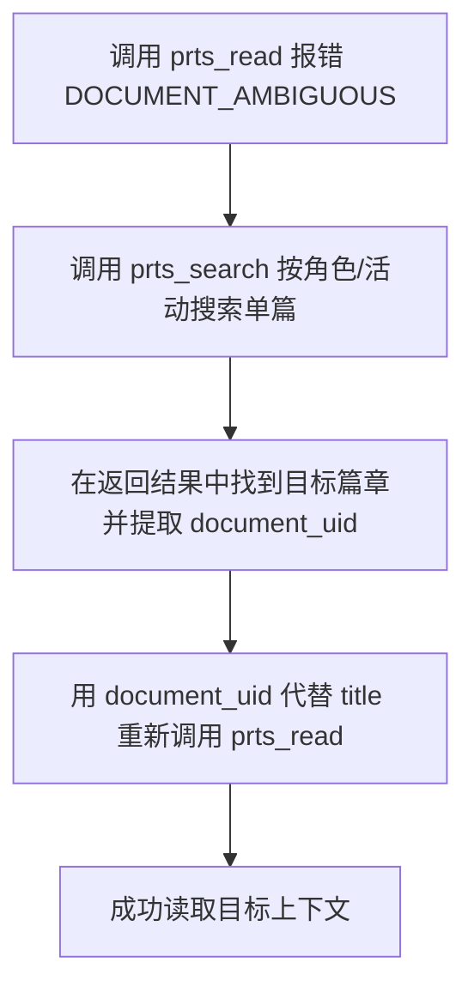

# PRTS 检索诊断与自愈排错指南

本技能专门用于指导 Agent 在遇到调用报错、0 命中、篇章歧义冲突、候选过多或超时时的自查与恢复，防止因机械盲试或错误推断导致死循环。

---

## 一、高频调用错误排查表

| 错误表现 / 错误码 | 典型诱因 | 正确自愈策略 |
| :--- | :--- | :--- |
| **`TIMEOUT: 候选文档发现超时`** | 1~2 字短词（如“魔王”）触发冷启动全分片解压扫描；或单核 VPS 计算负载超限。 | 1. 缩短或更换为更具特异性的 3~6 字专名； 2. 必须增加 `collection_names`（活动名）或 `character_names`（角色名）将扫描范围收窄到单个分片； 3. 提醒管理员在配置中调大 `search_timeout_seconds`。 |
| **`INVALID_REQUEST: ... must be an integer`** | 传了非法非整数（如浮点数 `101.5`、布尔值或非法字符串）。 | 参数必须为整数（或可安全转换的数字如 `101`、`101.0`、`"101"`）。检查 `line`、`max_lines`、`max_chars`、`segment` 是否有非法值。 |
| **`INVALID_REQUEST: 请提供 line、section 或 mode="document"`** | 传入了 `title` 和 `max_lines`，但没有指明如何读取。 | `max_lines` 仅限制单次返回上限，不能决定读取方式！必须补充 `line: 1`（定点读）或 `mode: "document"`（从头读全文）。 |
| **`DOCUMENT_AMBIGUOUS`（同名歧义）** | 存在多个同名活动或同名章节（如主线/活动同名，或多合集重名）。 | **严禁随机猜第一篇**！按下面“同名歧义消歧方案”操作。 |
| **`DOCUMENT_NOT_FOUND`（找不到）** | 拼写错误、使用了非官方简称、关卡代号格式错误或所选游戏模块不对。 | 1. 关卡代号只用于方舟，格式如 `15-17`、`CW-ST-4`； 2. 核对角色全称（如“阿米娅”而非“驴子”）； 3. 检查 `<prts:retrieval-context>` 确认该角色属于哪款游戏。 |
| **`CORPUS_GAME_NOT_INSTALLED`** | 该游戏资料库未启用或未下载对应分片。 | 停止该游戏范围的检索，向用户说明“当前本地未安装该游戏的资料库”，不得把未安装判定为“设定不存在”。 |
| **`PAGE_ANCHOR_VERSION_MISMATCH`** | 本地语料库在两次翻页之间被管理员热更新切换了版本。 | 旧的分页锚点失效，清空 `after`，从首屏重新发起检索。 |

---

## 二、同名篇章与合集歧义消歧方案（`document_uid`）

当 `prts_read` 提示存在多个同名记录（`DOCUMENT_AMBIGUOUS`）时，**绝不能任选一项，必须执行标准消歧闭环**：

1. **第一步（精准检索）**：调用 `prts_search`，指定精确的 `character_names` 或 `activity_names` 检索出候选篇章。
2. **第二步（提取 UID）**：在返回的篇章信息中找到目标的 `document_uid`（形如 `official:story:...` 或 `endfield:...`）。
3. **第三步（UID 直读）**：
   - 单篇定点读取：`prts_read({"document_uid": "提取到的UID", "line": 101})`；
   - 单篇全文读取：`prts_read({"document_uid": "提取到的UID", "mode": "document"})`；
   - 所属合集通读：`prts_read({"document_uid": "提取到的UID", "mode": "activity"})`。
4. **铁律**：**`document_uid` 与 `title` 互斥，绝不能同时提交！** `document_uid` 是内部标识符，严禁将其当作剧情事实暴露给用户。

---

## 三、零命中（0 Hits）逐步放宽排查单

遇到搜索结果为 0 时，请严格按照以下顺序逐步自愈，**严禁使用同一参数原地反复重试**：

1. **检查关键词长度**：
   - 错误做法：直接拿用户的整句问题搜（如 `“凯尔希在孤星里到底说了什么关于石棺的秘密”`）；
   - 正确做法：拆分为 2~4 字的高确定性连续原词（如 `“石棺”`），并加上 `character_names: ["凯尔希"]`、`activity_names: ["孤星"]`。
2. **检查过滤条件冲突**：
   - 是否把“正文提及”误写成了“亲口发言”？（`speakers` 极其严格，如果只是别人提到他，请改用 `entity_names`）；
   - 是否混淆了资源类型？（例如终末地没有 `operator_record`，方舟没有 `archive`）；
   - 尝试每次**仅移除一个**可能冲突的过滤条件（如先拿掉 `speakers`，再拿掉特定子类型）。
3. **检查游戏模块边界**：
   - 核对当前 `<prts:retrieval-context>` 提示块，确认该实体究竟属于方舟还是终末地；
   - 检查 `games` 字段是否填反。
4. **穷尽后的正确结论表述**：
   - 若翻页直至 `page.exhausted=true` 依然为 0 命中，说明本地资料库未收录该记录；
   - 严谨回答：“在当前 PRTS 本地资料中未检索到相关记载”，**严禁武断宣称“该事件在游戏里绝对没有发生”**。

---

## 四、Wiki 检索结果过杂与噪音排除

1. **痛点**：全词搜索导致整个角色的所有 Wiki 文本全被拉回，不仅消耗上下文，而且容易找错段落。
2. **根治策略**：
   - 查角色的综合身份与关系：改用 `resource_types: ["character_wiki"]` + `character_names`；
   - 查某活动的剧情主线：改用 `resource_types: ["story_wiki"]` + `activity_names`；
   - 只需某个段落：**省略 `query`**，只指定一个 `wiki_sections`（如 `["剧情总结"]` 或 `["简要介绍"]`），直接获取该块完整内容；
   - 辅助交叉页（`character_activity_wiki`）仅用于查看“特定人在特定活动的详情”，不作为首选宏观入口。
